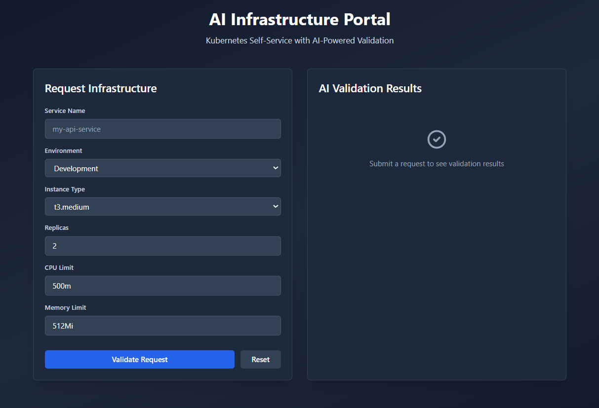
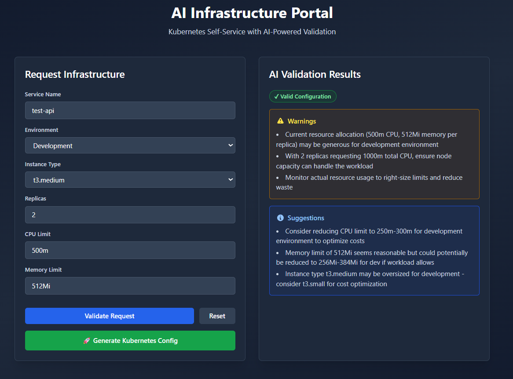
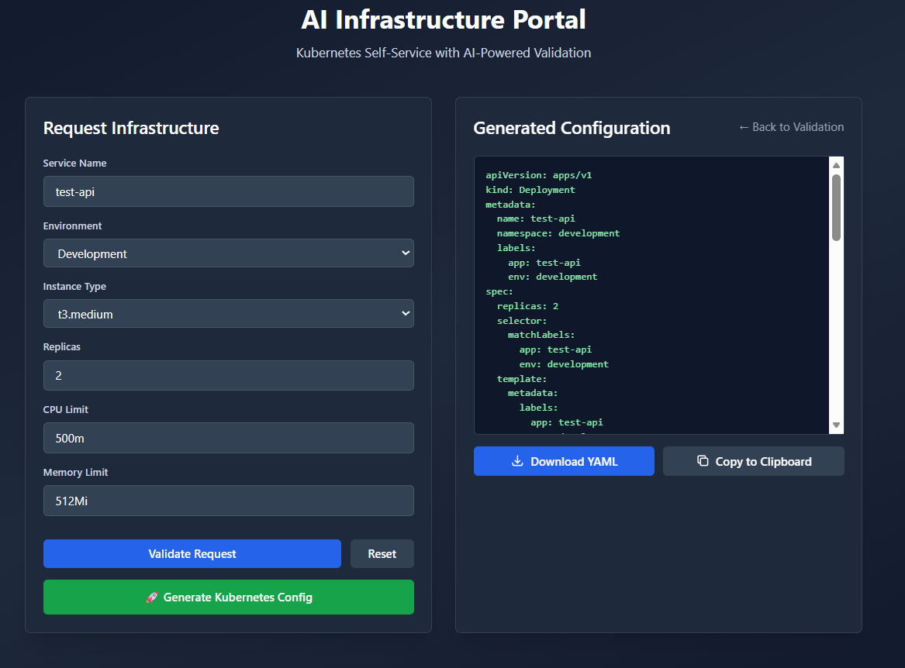

# AI Infrastructure Self-Service Portal

> A cloud-native platform engineering tool that leverages Claude AI to validate and generate Kubernetes infrastructure configurations through an intuitive web interface.


## 🎯 Project Overview

This self-service portal enables developers to request Kubernetes infrastructure through a web UI, with AI-powered validation and automated manifest generation. Built to demonstrate modern platform engineering practices and AI integration in cloud infrastructure automation.

### Key Features

- **AI-Powered Validation**: Claude AI analyzes resource requests for best practices, cost optimization, and potential issues
- **Automated Config Generation**: Generates production-ready Kubernetes Deployment and Service manifests
- **Environment-Aware**: Different validation rules for development, staging, and production environments
- **GitOps Ready**: Designed to integrate with ArgoCD for continuous deployment
- **Modern Stack**: FastAPI backend, React frontend, deployed on AWS EKS

## 🏗️ Architecture

```
┌─────────────────┐
│  React Frontend │
│   (Port 5173)   │
└────────┬────────┘
         │
         ▼
┌─────────────────┐      ┌──────────────┐
│  FastAPI Backend│─────▶│  Claude API  │
│   (Port 8000)   │      │  (Sonnet 4)  │
└────────┬────────┘      └──────────────┘
         │
         ▼
┌─────────────────┐
│   Git Repository│
│  (K8s Manifests)│
└────────┬────────┘
         │
         ▼
┌─────────────────┐
│     ArgoCD      │
│  (EKS Cluster)  │
└─────────────────┘
```

## 🚀 Tech Stack

**Backend**
- Python 3.11+
- FastAPI
- Anthropic Claude API (Sonnet 4)
- Pydantic for data validation

**Frontend**
- React 19
- Vite
- Tailwind CSS
- Axios

**Infrastructure**
- AWS EKS (Elastic Kubernetes Service)
- ArgoCD (GitOps)
- Helm (Deployment)

## 📋 Prerequisites

- Python 3.11 or higher
- Node.js 18+ and npm
- Anthropic API key ([Get one here](https://console.anthropic.com/))
- (Optional) AWS EKS cluster for deployment

## 🛠️ Local Development Setup

### Backend Setup

```bash
# Navigate to backend directory
cd backend

# Create virtual environment
python -m venv venv
source venv/bin/activate  # On Windows: venv\Scripts\activate

# Install dependencies
pip install -r requirements.txt

# Create .env file
echo "ANTHROPIC_API_KEY=your_api_key_here" > .env

# Run the server
uvicorn main:app --reload
```

Backend will be available at `http://localhost:8000`

### Frontend Setup

```bash
# Navigate to frontend directory
cd frontend

# Install dependencies
npm install

# Run development server
npm run dev
```

Frontend will be available at `http://localhost:5173`

## 📖 Usage

1. **Fill out the infrastructure request form**
   - Service name
   - Environment (development/staging/production)
   - Instance type
   - Number of replicas
   - CPU and memory limits

2. **Validate Request**
   - Click "Validate Request"
   - Claude AI analyzes the configuration
   - Receive feedback on issues, warnings, and suggestions

3. **Generate Configuration**
   - If validation passes, click "Generate Kubernetes Config"
   - Review the generated YAML manifests
   - Download or copy the configuration

4. **Deploy** (Coming Soon)
   - Commit to Git repository
   - ArgoCD automatically syncs and deploys

## 🎨 Screenshots

### Main Interface


### AI Validation Results


### Generated YAML


## 🔮 Roadmap

- [x] AI-powered validation
- [x] Kubernetes manifest generation
- [x] Download/copy generated configs
- [ ] Git integration for automatic commits
- [ ] ArgoCD deployment integration
- [ ] Deployment status tracking
- [ ] Multi-cloud support (GCP, Azure)
- [ ] Helm chart generation option
- [ ] User authentication
- [ ] Request history and audit logs

## 🤝 Contributing

This is a portfolio project, but suggestions and feedback are welcome! Feel free to open an issue or submit a pull request.

## 📝 License

MIT License - See [LICENSE](LICENSE) file for details

## 👤 Author

**Your Name**
- GitHub: [@Jtwoolbright](https://github.com/Jtwoolbright)
- LinkedIn: [linkedin.com/in/josh-woolbright](https://linkedin.com/in/josh-woolbright)

## 🙏 Acknowledgments

- Anthropic for Claude AI API
- FastAPI and React communities
- Platform Engineering best practices from the CNCF ecosystem

---

**Built with ❤️ for platform engineering**